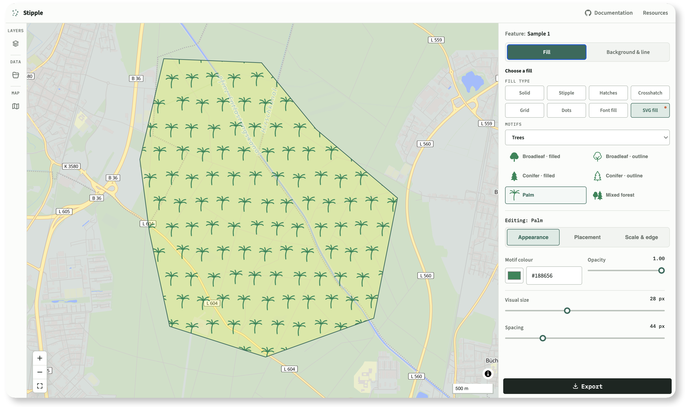

<picture><source media="(prefers-color-scheme: dark)" srcset="./assets/stipple-wordmark-dark.svg"><source media="(prefers-color-scheme: light)" srcset="./assets/stipple-wordmark-light.svg"></picture>

A focused library and visual playground for designing, generating, and
installing fill patterns in
[MapLibre GL JS](https://maplibre.org/maplibre-gl-js/docs/).

It supports geometric patterns, repeated text, and SVG symbols. Patterns can
be configured in JavaScript or prepared in the playground and exported as
MapLibre code.



<p align="center"><strong><a href="https://stipple.pages.dev/">➞ Run the playground</a></strong></p>


## What problem does it solve?

MapLibre already has a `fill-pattern` property that repeats an image inside a
polygon. That image still has to be created, made seamless, registered on the
map, and kept at an appropriate resolution when the display or style changes.

Stipple generates this image from a small set of pattern parameters. It draws
the tile in the browser, installs it with MapLibre's public `addImage` API,
and provides the corresponding `fill-pattern` value.

## What can I make with it?

- Geometric fills: solid, stipple, hatches, crosshatch, grid, and dots.
- Font fills: repeat a letter, an abbreviation, or a short bit of text.
- SVG fills: repeat one of the bundled symbols or bring your own SVG.
- A background colour and polygon outline to go with the pattern.

### Examples

<table>
  <tr>
    <td align="center" width="25%">
      <br>
      <sub><em>Solid</em></sub>
    </td>
    <td align="center" width="25%">
      <br>
      <sub><em>Stipple</em></sub>
    </td>
    <td align="center" width="25%">
      <br>
      <sub><em>Hatches</em></sub>
    </td>
    <td align="center" width="25%">
      <br>
      <sub><em>Dots</em></sub>
    </td>
  </tr>
  <tr>
    <td align="center" width="25%">
      <br>
      <sub><em>Grid</em></sub>
    </td>
    <td align="center" width="25%">
      <br>
      <sub><em>Font fill</em></sub>
    </td>
    <td align="center" width="25%">
      <br>
      <sub><em>SVG fill</em></sub>
    </td>
    <td align="center" width="25%">
      <br>
      <sub><em>Or even your custom SVG</em></sub>
    </td>
  </tr>
</table>

You can change the colour, opacity, spacing, weight, angle, scale, and layout.
Font fills also let you choose the typeface, style, and letter spacing. SVG
fills can use regular rows, offset rows, or a more natural-looking seeded
distribution.

The playground includes 34 SVG motifs covering vegetation, trees,
agriculture, water, terrain, land use, and simple shapes. The same seed always
produces the same arrangement.


## But can’t I just ask AI to do this?

Fair point. But Stipple can fit into that workflow.

Whether you build maps by writing code yourself or with the help of AI,
the playground gives you direct visual control over the result.
Instead of refining a pattern through a back-and-forth series of prompts
and corrections, you can adjust it interactively until it looks exactly
the way you want.

Once you're happy with the result, export the corresponding MapLibre code
or Stipple configuration and use it directly in your project, or feed it
back into your AI-assisted workflow.

## Run the playground

[Open the Stipple playground](https://stipple.pages.dev/). No installation or
coding is required. Start with the included sample polygons or import your own
data, customize the fills visually, and export the result. Files are processed
locally in the browser and are not uploaded to a server.

### Run it locally

From a clone of this repository, install the development dependencies and
build Stipple:

```sh
npm install
npm run build
```

The repository itself is the `stipple-maplibre` package, so you do not need to
install it separately. Then open the local
[`demo/index.html`](./demo/index.html) file in your browser.

## Supported file formats

The basic input is GeoJSON. The playground also understands GeoPackage,
GeoParquet, Shapefile (loose or zipped), FlatGeobuf, KML, GPX, GML, DXF, and
other common vector formats.

Polygon and MultiPolygon features are supported. If a file contains several
polygon parts, each one can have its own style. Non-polygon features are
ignored.

Imports are limited to 200 MB per dataset and the first 64 polygon parts.
Formats with a known CRS are reprojected to WGS84 in the browser.

## Installation

Install the package alongside MapLibre GL JS:

```sh
npm install stipple-maplibre maplibre-gl
```

`maplibre-gl` is a peer dependency. Stipple currently supports MapLibre GL JS
versions 4, 5, and 6.

## Basic usage

This example adds a 45-degree hatch texture to an existing GeoJSON source
called `my-polygons`:

```js
import maplibregl from "maplibre-gl";
import { syncPatternTexture } from "stipple-maplibre";

const map = new maplibregl.Map({
  container: "map",
  style: "https://tiles.openfreemap.org/styles/liberty",
});

map.on("load", () => {
  syncPatternTexture(map, {
    imageId: "my-hatches",
    pattern: "hachures",
    size: 33,
    color: "#2c6a5b",
    weight: 2,
    angle: 45,
  });

  map.addLayer({
    id: "my-pattern-layer",
    type: "fill",
    source: "my-polygons",
    paint: {
      "fill-pattern": "my-hatches",
      "fill-opacity": 1,
    },
  });
});
```

The generated texture is registered as `my-hatches`, and that same name is
used in the layer's `fill-pattern` property.

## SVG patterns

Pass Stipple an SVG string and choose how the symbols should be spread out:

```js
import { installSvgPatternFill } from "stipple-maplibre";

await installSvgPatternFill(map, {
  imageId: "grass-pattern",
  svg: grassSvgMarkup,
  seed: "parcel-42",
  distribution: "natural",
  minSpacing: 4,
});
```

You can then use `grass-pattern` as the layer's `fill-pattern`. The playground
also accepts pasted SVG markup or an uploaded `.svg` file.

## Font patterns

Font fills are rasterized after the requested web font is ready:

```js
import { installFontPatternFill } from "stipple-maplibre";

await installFontPatternFill(map, {
  imageId: "vineyard-letters",
  text: "V",
  fontFamily: "'Source Serif 4', serif",
  fontSize: 20,
  fontStyle: "italic",
  horizontalSpacing: 26,
  verticalSpacing: 22,
  rotationDeg: -20,
  stagger: true,
  color: "#315f2f",
});
```

Use `vineyard-letters` as the layer's `fill-pattern` in the same way.

## From the playground to MapLibre

The playground can export:

- ready-to-use MapLibre code;
- a reusable Stipple configuration;
- a MapLibre style document;
- a bundle containing the generated pattern images.

For code-driven styles, `buildStyleFragment` creates the background, pattern,
and outline layers together. The resulting style metadata carries the pattern
recipe. After the style loads, `installPatternFills` reads those recipes and
installs every texture the map needs:

```js
import { installPatternFills } from "stipple-maplibre";

map.on("load", async () => {
  await installPatternFills(map, map.getStyle());
});
```

If your application replaces styles while it is running, use one observer to
keep the patterns installed:

```js
import { observePatternFills } from "stipple-maplibre";

const patterns = observePatternFills(map);
map.on("load", () => patterns.refresh());

// When the map or component is removed:
patterns.dispose();
```

## Are exported styles normal MapLibre JSON?

The layers are normal MapLibre layers, with one additional runtime step:
generated textures cannot live inside plain style JSON. Stipple stores their
recipes in versioned layer metadata, then recreates and installs the images
when the style loads.

MapLibre, Maputnik, and MapLibre Native do not interpret the
`maplibre-pattern-fills:v1` metadata on their own. Call `installPatternFills`,
or export the generated PNG bundle when a runtime dependency is not suitable.

The metadata format is documented in
[`schema/pattern-metadata-v1.schema.json`](./schema/pattern-metadata-v1.schema.json).

## Rendering details

### Zoom behaviour

Two scaling modes are available:

- **Screen scale** keeps the pattern the same visual size on screen.
- **Ground scale** makes it behave like something printed on the map itself.

Ground-scaled patterns use several texture sizes and let MapLibre blend
between them. That avoids the sudden jump you normally get at integer zoom
levels. Stipple patterns also keep the same deterministic layout while they
scale, so dots and symbols do not reshuffle on every zoom.

By default, textures follow the display pixel ratio, capped at 2x. You can
also force a softer 1x texture when that suits the map better.

### Symbols at polygon edges

A repeating `fill-pattern` is always clipped at the polygon boundary. That is
how MapLibre works.

Stipple also includes an experimental `installSvgIconScatter` API. Instead of
drawing one repeating texture, it places individual symbols only where the
whole icon fits inside the polygon. It is useful when clipped trees, houses,
or other recognizable symbols would look wrong. This API may still change
before version 1.0.

## Security and browser support

If you let people provide their own SVG, treat that markup as untrusted input.
Apply the same validation and Content Security Policy rules you use elsewhere
in your application.

SVG rasterization uses a temporary `blob:` image URL, so a restrictive CSP
must allow `blob:` in `img-src`.

The package targets modern evergreen browsers and Node.js 18 or newer. SVG
and font rasterization need a browser; the geometric pattern engine also runs
in Node.

## Repository structure

- `src/engine` draws patterns, scatters points, and calculates zoom scaling.
  It has no MapLibre dependency.
- `src/maplibre` connects those pieces to MapLibre GL JS.
- `demo/` contains the playground, its motif catalogue, and its interface.
- `schema/` contains the exported metadata schema.

## Project status

Version `0.1.1` is available on
[npm](https://www.npmjs.com/package/stipple-maplibre). The whole-symbol
scatter API is the only part currently marked experimental.

## Licence

MIT. See [LICENSE](./LICENSE).
